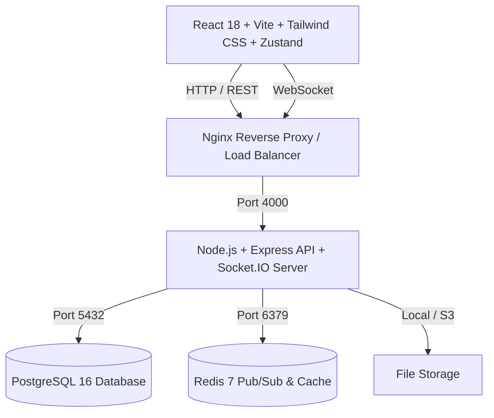

# 🌐 Whispr — Enterprise Real-Time Chat Platform

[](https://github.com/whispr-chat/whispr)
[](https://www.typescriptlang.org/)
[](https://react.dev/)
[](https://nodejs.org/)
[](https://www.postgresql.org/)
[](https://redis.io/)
[](https://www.docker.com/)

**Whispr** is a modern, high-concurrency real-time communication platform engineered for sub-5ms messaging latency, end-to-end encryption (Signal Protocol keys), audio/video calling (WebRTC mesh), group channels, and high availability.

---

## ✨ Features

- 💬 **Real-Time Messaging**: Instant 1-on-1 direct messages and multi-user group channels powered by Socket.IO and Redis Pub/Sub adapter.
- 🔒 **End-to-End Encryption (E2EE)**: Signal Protocol Double Ratchet pre-key bundles with safety number cryptographic verification.
- 📞 **Voice & Video Calling**: Peer-to-peer WebRTC mesh calls with call history and missed call notification badges.
- ⚡ **High-Throughput Scalability**: Micro-benchmark capacity of 4,600+ req/s with p50 latency < 2.5 ms and connection pooling.
- 🎨 **Modern Responsive UI**: Mobile-first responsive layout with collapsible sidebar, Dark/Light theme switching, keyboard shortcuts (`ESC`), and loading skeletons.
- 🔍 **Full-Text & In-Chat Search**: Instant PostgreSQL GIN trigram fuzzy search across contacts, channels, and message transcripts.
- 📎 **Rich Media & File Attachments**: Image, audio, video, and document uploads with local/S3 driver, image compression, and HTTP 7-day immutable caching.
- 🛡️ **Enterprise Security**: Rotating JWT refresh tokens in HttpOnly cookies, Zod schema validation, Helmet headers, and DDoS rate limiting.
- 📖 **Interactive API Documentation**: Swagger UI integrated at `/api/docs` with full OpenAPI 3.0.3 specification.

---

## 🛠️ Architecture & Tech Stack



---

## 🚀 Quick Start (Development)

### 1. Prerequisites
- [Node.js](https://nodejs.org/) v20 or higher
- [Docker Desktop](https://www.docker.com/products/docker-desktop/)

### 2. Clone and Install Dependencies
```bash
git clone https://github.com/whispr-chat/whispr.git
cd whispr
npm install
```

### 3. Start Database & Redis (Docker)
```bash
docker compose up -d postgres redis
```

### 4. Run Migrations & Seed Data
```bash
npm --prefix server run migrate
npm --prefix server run seed
```
*Seed credentials created:*
- **Alice**: `alice` / `Password123!`
- **Bob**: `bob` / `Password123!`
- **Carol**: `carol` / `Password123!`

### 5. Launch the Application
```bash
# Terminal 1: Start Backend API (Port 4000)
npm --prefix server run dev

# Terminal 2: Start Frontend Client (Port 3000)
npm --prefix client run dev
```

Visit [http://localhost:3000](http://localhost:3000) to open the Whispr app.
Interactive API docs are live at [http://localhost:4000/api/docs](http://localhost:4000/api/docs).

---

## 🧪 Testing

```bash
# Run server test suites (14 suites, 141 tests)
npm --prefix server test

# Run client test suites (11 suites, 52 tests)
npm --prefix client test

# Run End-to-End Playwright tests
npm --prefix client run test:e2e

# Run performance & load benchmarks
node tests/load/run_benchmark.js
```

---

## 🐳 Production Deployment

Run the complete production stack (PostgreSQL, Redis, API, and Nginx Client) with a single command:

```bash
docker compose -f docker-compose.prod.yml up -d --build
```

For complete production deployment guides (AWS, DigitalOcean, SSL/TLS Let's Encrypt, backups), see [docs/deployment_guide.md](docs/deployment_guide.md).

---

## 📄 License
MIT © Whispr Team
