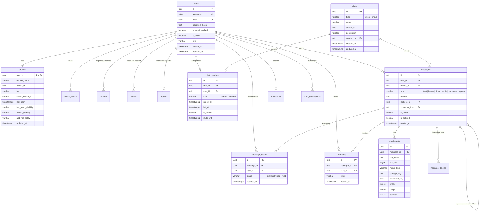

# Whispr Platform — Architecture & ERD Specification

## 1. System Overview

Whispr is an enterprise-grade, high-concurrency real-time communication platform designed for low-latency messaging, robust presence tracking, and rich media sharing.

### Tech Stack

- **Frontend**: React 18, TypeScript, Tailwind CSS, Zustand, Vite
- **Backend**: Node.js, Express, TypeScript, Socket.IO
- **Database**: PostgreSQL 16 (relational schema, transactional integrity, GIN trigram full-text search)
- **Cache & Pub/Sub**: Redis 7 (ephemeral presence tracking, socket cluster adapter, rate limiting)
- **Object Storage**: S3-compatible (MinIO / AWS S3) with local disk fallback in development
- **Auth**: JWT (short-lived access tokens + rotating refresh tokens with bcrypt hash), bcrypt password hashing

---

## 2. Entity Relationship Diagram (ERD)

---

## 3. Database Indexing & Optimization Strategy

1. **Primary Key Clustering**: All tables use UUIDv4 (`gen_random_uuid()`) for decentralized generation.
2. **Chat Timeline Queries**: `messages(chat_id, created_at DESC) WHERE is_deleted = FALSE` enables instantaneous reverse-chronological pagination.
3. **Membership Index**: Partial index `chat_members(user_id) WHERE left_at IS NULL` allows sub-millisecond retrieval of all active dialogs for a user.
4. **Full-Text Search (FTS)**: GIN index over `to_tsvector('english', COALESCE(content, ''))` on `messages` enables scalable keyword search across millions of messages.
5. **Presence & Heartbeats**: Stored in Redis with `SETEX presence:<user_id> 30 "online"` to offload high-frequency transient writes from PostgreSQL.
